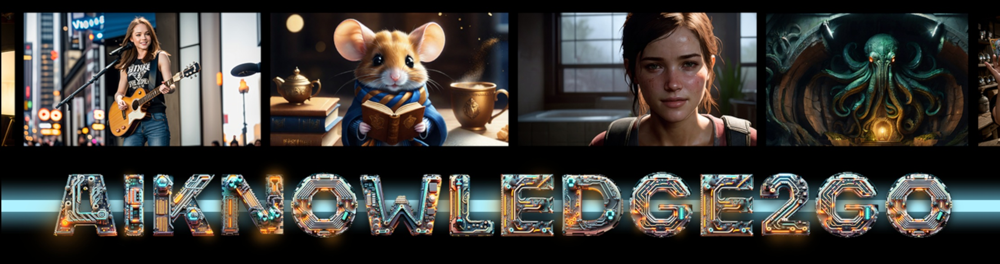
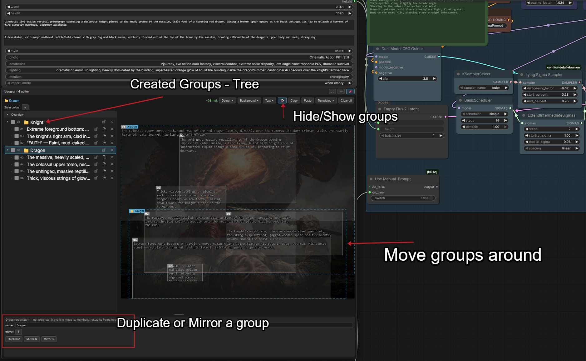
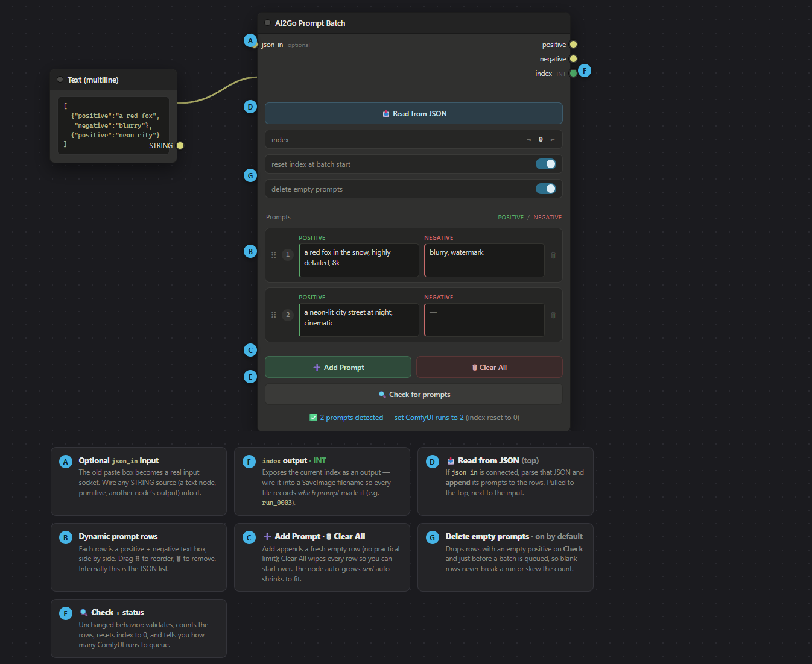

# ComfyUI-AI2Go-Utils

ComfyUI nodepack by AIKnowledge2Go

> ℹ️ **Published for reference.** Issues are disabled and pull requests are closed automatically —
> this repo doesn't accept contributions, and no support is provided. You're welcome to fork and
> adapt it under the GPL-3.0 license.

## Contact

> **⚠️ YouTube:** My YouTube channel is dead:
> [AIKnowledge2Go IS DEAD]https://www.patreon.com/AIKnowledgeCentral/posts/aiknowledge2go-163707956
>
> I'm building a new one. Please give me a little time. ❤️ 
> I won't upload the old ❌📹 videos. They are available for patreon members.

- **📹 YouTube:** [Into The Latent](https://www.youtube.com/@IntoTheLatent)
- **📬 Newsletter:** [AI News](https://intothelatent.com/newsletter)
- **🌐 Website:** [Into The Latent](https://intothelatent.com)
- **❤️ Patreon:** [AIKnowledgeCentral](https://patreon.com/AIKnowledgeCentral)
- **📆 Book a 1-on-1 Session:** [Stable Diffusion Coaching](https://koalendar.com/e/1hr-1-on-1-stable-diffusion)
- **✉️ Email:** BeyondMatrixDevelopments@gmail.com
- **🎨 Civitai:** [AIKnowledge2Go](https://civitai.com/user/AIknowlege2go)

## Installation

Clone into your ComfyUI `custom_nodes` directory and restart ComfyUI:

```bash
cd ComfyUI/custom_nodes
git clone https://github.com/Little-God1983/ComfyUI-AI2Go-Utils
```

No extra dependencies (it uses Pillow, already shipped with ComfyUI). It can coexist with
ComfyUI-KJNodes — both Ideogram 4 nodes run side by side without conflict.

## Nodes

### AI2Go Ideogram 4 Prompt Builder

A visual prompt builder for **Ideogram 4's structured JSON caption** format. Draw bounding-box
**regions** on a canvas, describe each one, and the node assembles the caption — with a full
scene-graph **Overview**, region **parenting**, and named **groups** layered on top.

**Outputs:** `prompt` (the caption JSON), `preview` (a rendered overlay image), `bboxes`
(pixel-space boxes for SAM3 / crop nodes), `width`, `height`.



#### Region editor (canvas)

- **Draw** by dragging; move and resize with handles; **Ctrl-drag** to force-draw over an existing box.
- Per-region **type** (object / text), description, verbatim text, and a **color palette**; editable
  bbox fields (pixels + the 0–1000 grid).
- **Multi-select** — shift-drag marquee, shift-click toggle; **Alt-click** cycles overlapping boxes;
  **Del** / **Ctrl+C·V·D** to remove / copy / paste / duplicate.
- **Lock** regions, composition **guides** (thirds / grid / golden ratio / spiral), **snap-to-grid**,
  and adjustable label & box styling.
- **Background**: a connected reference image, the **last generated image** ("Grab BG"), or the
  **live sampling preview** — with a brightness control.
- Dockable / pinnable / fullscreen panel, a live **token estimate**, and output settings
  (compact/pretty JSON, normalized/absolute coords, `yx`/`xy` bbox order).

#### Overview (scene tree)

- A persistent, collapsible panel listing **every region** — click a row to select it (synced both
  ways with the canvas), so you can pick and edit a region without nudging it.
- **Ctrl/Cmd-click** to multi-select, **Shift-click** for a range.
- Lock, duplicate, and delete from the list; **drag a row — or a whole multi-selection — onto another
  to nest it**; drop on the header to send back to root.

#### Parenting & groups

- **Parent** any region under another: move a parent on the canvas and its children follow. Deleting a
  parent promotes its children to the grandparent (no surprise subtree wipe).
- **Groups** — right-click the Overview → *Create group from selection* to wrap regions in a **named**
  container:
  - Move the group → everything moves; **resize the group → its members scale**.
  - **Duplicate** the whole group, or **mirror** its members **horizontally / vertically**.
  - Deleting a group keeps its children.
  - Groups are editor-only organizers — **never part of the exported prompt**. Toggle their frames on
    the canvas with **👁️** (hidden by default; always listed in the Overview).

#### Copy / paste & interop

- **Copy** / **Paste** the caption JSON, and save/load named **Templates** (stored server-side).
  Each template can carry an optional **preview image** — click 📷 in the Templates menu to pick one
  (it's center-cropped to a 200×200 webp), or just drop a matching `<template-name>.{webp,png,jpg,jpeg}`
  next to the template file and it's picked up automatically.
- Copies carry a small `_ai2go` sidecar that preserves the full layout (groups + hierarchy) for a
  **lossless AI2Go → AI2Go** round-trip, while staying **two-way compatible with ComfyUI-KJNodes**:
  KJNodes ignores the extra data and loads the flat scene, and KJNodes captions load here flat too.
  The sidecar never reaches the model prompt.

### AI2Go Ideogram 4 Style Wizard

A "click-together" helper for the **style fields** of an Ideogram 4 caption — so you don't have to type
`aesthetics` / `lighting` / `medium` / `photo` / `art_style` by hand.

- Wire the wizard's **`style`** output into a **Prompt Builder's `import_json`** input (the link just
  tells the wizard which builder to fill).
- Click **🪄 Open Style Wizard** to open a two-tab modal. On the **Pick styles** tab, toggle one or many
  chips per category (they're comma-joined) or type your own; a **search box** filters chips, a **live
  JSON preview** shows the assembled `style_description`, and a **status line** names the builder you're
  writing to (or warns if nothing's connected).
- **Photo vs. art_style** are both selectable; if you set both, a warning notes that only `photo` is
  applied (Ideogram allows only one).
- **Apply** pushes the picks to the connected builder without closing (handy for tweaking); **Apply &
  close** (and Esc / clicking the backdrop) does the same and closes. Either way the picks are
  **written straight into the builder's** style widgets — your bounding boxes, color palette, and
  `high_level_description` are left untouched, and the node emits an empty string at run time so the
  `import_json` wire never overwrites the builder's regions.

**Editable chip presets.** The chip lists live in
`ComfyUI/user/default/ai2go/ideogram4/WizardStylesDefault.json`. Edit them right in the wizard on the
**Edit presets** tab — add, rename, or delete chips per category, then **Save to file** (or **Discard** /
**Restore defaults**). You can also hand-edit the JSON (each entry's `key` must be one of `aesthetics`,
`lighting`, `medium`, `photo`, `art_style`). If the file is **missing or malformed**, the wizard falls
back to the built-in defaults and shows a warning (with the exact parse error) plus a **Restore
defaults** button that (re)creates the file.

### AI2Go Prompt Batch

Run a **list of prompts one at a time** across a queued batch — the text analog of the classic
"Load Image Batch + increment index" trick. ComfyUI has no real for-loop, so you queue N runs by hand
and this node walks the list, emitting one prompt per run.

**Outputs:** `positive`, `negative`, `index` (the 0-based index used this run — wire it into a
SaveImage filename so each file records *which prompt* made it).



#### Editing prompts

- A dynamic **row editor** (in the spirit of rgthree's Power Lora Loader): each row is a **positive**
  and **negative** text box side by side. **➕ Add Prompt** appends a row, **🗑** removes one, and the
  **⠿** handle drag-reorders. The node **auto-grows and auto-shrinks** to fit; stretch it wider for
  roomier boxes.
- **📥 Read from JSON** — wire a text/primitive node holding a JSON prompt list into the optional
  `json_in` socket, then click to **append** it to the rows.
- **🗑 Clear All** wipes the list.
- The rows are the source of truth; internally they serialize to the JSON array
  `[{"positive": "...", "negative": "..."}, ...]` (a bare string is treated as positive-only), stored
  in a hidden field that both saves with the workflow and drives execution.

#### JSON structure

The prompt list — whether typed into the rows or imported via **📥 Read from JSON** — is a JSON
**array**, one entry per queued run:

```json
[
  { "positive": "a red fox in the snow, highly detailed, 8k", "negative": "blurry, watermark" },
  { "positive": "a neon-lit city street at night, cinematic" }
]
```

- **`positive`** *(required)* — the prompt text; must be non-empty.
- **`negative`** *(optional)* — defaults to `""` when omitted or `null`.

The importer also accepts these convenience forms:

- A **bare string** entry is treated as positive-only — `["a red fox", "a neon city"]`.
- **`prompt`** works as an alias for `positive`.
- The array may be wrapped in an object — `{ "prompts": [ ... ] }`.

Each run emits the entry at `index` (0-based) and the batch walks `0, 1, 2, …`. Entries with an empty
`positive` are dropped when **Delete empty prompts** is on; otherwise they raise a "positive is empty"
error at run time.

#### Running a batch

1. Build the list, then click **🔍 Check for prompts** — it validates, counts N, resets the index to 0,
   and tells you how many runs to queue.
2. Set ComfyUI's **queue/run count to N** and run. The node advances `index` by 1 after each run
   (immune to the "Widget Value Control Mode" setting), walking 0, 1, 2… across the batch.

**Toggles.**

- **Reset index at batch start** (default on) — zero the index when a new batch is queued, so every
  batch starts from the first prompt.
- **Delete empty prompts** (default on) — drop rows with an empty positive on **Check** and just before
  a batch is queued, so blank rows never break a run or skew the count.

If the index ever overshoots the list (more runs than prompts), it clamps to the last prompt instead of
erroring.

### AI2Go Save Metadata (Civitai)

Two output nodes that save PNG(s) with an **A1111-style `parameters` text chunk** — the flat,
human-readable format Civitai actually parses to show the prompt and auto-link the checkpoint and
LoRAs. ComfyUI's stock Save Image embeds the raw `workflow`/`prompt` graph instead, which Civitai
can't reliably read back into a prompt — and for a dynamic workflow (our own **AI2Go Prompt Batch**
is the worst case: one graph, N prompts, disambiguated only by a run index) it's actively
misleading. These nodes trace the graph at save time to capture the **real prompt used on this
specific run**.

**AI2Go Save Metadata (Civitai)** (Basic) auto-traces everything — positive, negative, steps, CFG,
seed, sampler, scheduler, model, and LoRAs — by walking backward from the KSampler feeding the saved
image (falling back to "the only sampler in the graph" if that walk doesn't land on one). When the
positive/negative text comes from an **AI2Go Prompt Batch** node, the trace reads that node's
current `index` and resolves the exact line that ran for this queue item, not the whole batch list.

**AI2Go Save Metadata (Civitai) Advanced** adds optional override sockets — `positive`, `negative`,
`steps`, `cfg`, `seed`, `sampler_name`, `scheduler` — that win over the trace when wired. Wiring a
Prompt Batch node's `positive`/`negative` outputs straight into these sockets is the reliable path
for dynamic/batch prompts: no static-graph guessing, just the string that actually ran. Model and
LoRAs are always auto-traced on both nodes — a variable-length LoRA chain isn't practical to socket,
and it's static graph data regardless of which prompt ran.

The model/LoRA walk recognizes checkpoints and standalone diffusion models (**Load Diffusion Model** /
GGUF unet loaders), and picks up LoRAs from ComfyUI's stock **Load LoRA** (`LoraLoader` /
`LoraLoaderModelOnly`) as well as rgthree's **Power Lora Loader** and **Lora Loader Stack** — including
several LoRAs in one node. Disabled rows and empty (`None`) / zero-strength slots are skipped, matching
what actually loads.

#### What gets written

One `parameters` chunk, A1111 order:

```
{positive} <lora:name:weight> ...
Negative prompt: {negative}
Steps: …, Sampler: …, CFG scale: …, Seed: …, Size: …, Model hash: …, Model: …, Lora hashes: "...", Version: ComfyUI
```

Each traced LoRA is appended to the positive line as a `<lora:name:weight>` tag and listed again in
`Lora hashes:` — both signals Civitai uses to auto-link the resource. Unknown/unresolved fields are
omitted, never guessed; if something can't be traced (e.g. two KSamplers in the graph, or a dynamic
prompt source the tracer doesn't recognize), a warning names the unresolved field(s) in the ComfyUI
log / node progress text, so you know to wire the Advanced node's sockets.

#### Test button

Both nodes have a **🔎 Test detection** button that runs the same trace against the *live* editor
graph and previews positive/negative, steps/cfg/sampler/seed, model, LoRAs, and any unresolved
fields — so you can check exactly what will be saved before queuing a run.

#### `save_workflow`

Off by default. **Off** — the PNG carries only the Civitai `parameters` chunk. **On** — it also
embeds the ComfyUI `workflow`/`prompt` chunks, the same as the stock Save Image, if you still want
the graph recoverable from the file.

#### Model & LoRA hashing

Civitai matches a checkpoint/LoRA to its resource page by **AutoV2** — the first 10 hex characters
of the file's full SHA-256. Hashing a multi-GB checkpoint is slow, so hashes are cached in
`.hash_cache.json` (in the pack folder, git-ignored) keyed by path + size + mtime: the **first save
of a new checkpoint or LoRA pays the hashing cost once**; every save after that is instant.

> **Verification pending:** the AutoV2 hash flavor is the one Civitai's own docs index against, but
> end-to-end confirmation — uploading a real image and watching Civitai auto-link the checkpoint and
> LoRA(s) — is still a pending manual check.

#### Assumption

Both nodes assume **one KSampler** in the workflow. Multi-sampler graphs (e.g. a hires-fix pass with
two KSamplers) aren't disambiguated by the trace; wire the Advanced node's override sockets in that
case.

## Credits & License

Licensed under **GPL-3.0** — see [LICENSE](LICENSE).

Only the **Ideogram 4 Prompt Builder** node and its canvas editor are derived from
[**ComfyUI-KJNodes**](https://github.com/kijai/ComfyUI-KJNodes) by **Kijai** (GPL-3.0). Huge thanks to
Kijai for that original work — the derived files retain their attribution.

Everything else in this pack — the **Ideogram 4 Style Wizard**, the **Resolution Selector**, the
**Prompt Batch** node, and the **Save Metadata (Civitai)** nodes — is original development by
**AIKnowledge2Go**.

Because the pack includes Kijai's GPL-3.0 code, the whole pack is released under **GPL-3.0** as well.
