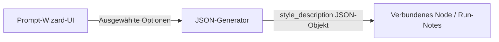
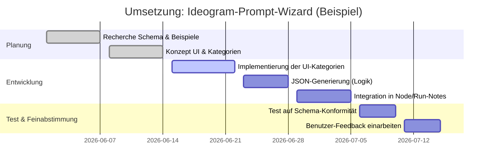

# Visueller Ideogram 4.0 Prompt-Builder (Wizard) Node 

**Kurzfassung:** Das Ideogram-4.0-Promptformat setzt auf ein strukturiertes JSON-Schema mit festen Feldern. Das wichtigste Objekt ist `style_description`, das genau die Felder **„aesthetics“**, **„lighting“**, **„medium“** und **entweder** **„photo“** **oder** **„art_style“** (sowie optional **„color_palette“**) enthalten muss. In diesem Bericht werden (a) alle relevanten JSON-Felder erklärt, (b) je Kategorie (`Style`/Kunststil, `Foto`/Kamera, `Ästhetik`, `Beleuchtung`, `Medium`) mindestens zehn Beispiel-Buttons mit den exakten JSON-Ausgaben und den zugehörigen Schlüsseln präsentiert, (c) Validierungsregeln und Randfälle diskutiert, (d) UI-Implementierungsvorschläge (z.B. dreistufige Chips, Mehrfachauswahl, Speichern ins Run-Notes) gegeben und (e) Beispiel-JSON-Snippets erzeugt. 

## Ideogram 4.0 JSON-Schema (Wesentliche Felder)

Ideogram-4.0-Prompts bestehen aus einem JSON-Objekt mit drei Hauptebenen:

- **`high_level_description` (optional)** – wird vom user manuel gegeben
- **`style_description` ** – Vorgabe von Stil, Licht, Medium, Farbpalette. **Enthält genau eines von `photo` oder `art_style`** (Fotos vs. Illustrationen) sowie zwingend **`aesthetics`**, **`lighting`** und **`medium`**. **`color_palette`** (Hex-Farben) ist optional. Die Schlüsselreihenfolge ist wichtig: 
  - *Foto-Modus*: `aesthetics` → `lighting` → `photo` → `medium` → (optional `color_palette`). 
  - *Illustrations-Modus*: `aesthetics` → `lighting` → `medium` → `art_style` → (optional `color_palette`). 
- **`compositional_deconstruction` (erforderlich)** – Beschreibung des Bildhintergrunds (`background`) und eine Liste von `elements` (Objekte oder Text) mit optionalen Bounding-Boxen. (Details dazu hier nicht vertieft.)

**Wichtige Regeln:** Genau einer der Schlüssel `photo` _oder_ `art_style` muss verwendet werden (je nachdem, ob das Bild als Foto oder Illustration gedacht ist). Alle anderen Felder (`aesthetics`, `lighting`, `medium`) müssen enthalten sein, wenn `style_description` benutzt wird. Die Verwendung von Doppelbelegungen oder Fehlangaben führt zu Schema-Fehlern. Beispielsweise kann in einem Foto-Prompt **nicht** gleichzeitig ein `art_style`-Eintrag vorkommen; stattdessen muss `medium: "photograph"` verwendet werden.  

> *Beispiel (JSON aus Ideogram-Prompterklärung):*  
> ```json
> "style_description": {
>   "aesthetics": "serene, warm, golden hour",
>   "lighting": "golden hour backlighting, warm atmospheric haze",
>   "photo": "wide angle, f/8, long exposure",
>   "medium": "photograph",
>   "color_palette": ["#FF6B35", "#F7C59F", "#004E89", "#1A659E", "#2B2D42"]
> }
> ```  
> *Dieses Beispiel stammt aus Ideograms Leitfaden und zeigt die Felder für einen Sonnenuntergang (Foto-Modus).*  

## Kategorie-Buttons: Vorschläge und JSON-Mapping

Wir gliedern die Button-Kategorien wie folgt (die JSON-Ziele in Klammern):  

- **Style (Kunststil, z.B. art_style)** – Für illustrative (nicht-fotografische) Stile/Gestaltungen.  
- **Foto (Kamera/Linse, z.B. photo)** – Kameratypen, Objektive oder Fototechniken für Fotos.  
- **Ästhetik (aesthetics)** – Stimmung/Stil-Kriterien.  
- **Beleuchtung (lighting)** – Lichtsituationen.  
- **Medium (medium)** – Ausgabeart (Foto, Illustration, 3D-Render usw.).  

Folgende Tabellen zeigen je Kategorie mindestens zehn Buttons, ihre exakte JSON-Ausgabe (Wert) und den zugehörigen JSON-Schlüssel. Alle Ausgabewerte sind als String formuliert und werden jeweils in Anführungszeichen in das JSON geschrieben. Mehrfachauswahl-Betätigung bedeutet in der Regel: mit Komma getrennte Liste der gewählten Begriffe. 

### Stil (Kunststil, `style_description.art_style`)

| Button                         | JSON-Ausgabe                          | JSON-Key        |
|--------------------------------|---------------------------------------|-----------------|
| Flat Vector Illustration       | `flat vector illustration`           | `art_style`     |
| Oil Painting                   | `oil painting`                       | `art_style`     |
| Watercolor                     | `watercolor illustration`            | `art_style`     |
| Pencil Sketch                  | `pencil sketch illustration`         | `art_style`     |
| Comic Book Style               | `comic book style`                   | `art_style`     |
| Isometric Illustration         | `isometric illustration`             | `art_style`     |
| Anime Illustration             | `anime illustration`                 | `art_style`     |
| Low-Poly 3D Render             | `low-poly 3D render`                 | `art_style`     |
| Hand-Drawn Doodles             | `hand-drawn doodles style`           | `art_style`     |
| Retro Futuristic Concept Art   | `retro-futuristic concept art`       | `art_style`     |
| Flat Graphic Design            | `flat graphic design style`          | `art_style`     |
| Art Deco Style                 | `art deco style`                     | `art_style`     |

*Beispiele:* "flat vector illustration" und "comic book style" stammen aus Ideograms Prompts und Community-Vorschlägen. Sie entsprechen kreativ definierten Kunststilen (nicht zu verwechseln mit dem **Medium**). 

### Foto (Kamera/Linse, `style_description.photo`)

| Button                         | JSON-Ausgabe                          | JSON-Key    |
|--------------------------------|---------------------------------------|-------------|
| 35 mm, f/1.4                   | `35mm lens, f/1.4`                    | `photo`     |
| 50 mm, f/1.8                   | `50mm lens, f/1.8`                    | `photo`     |
| 85 mm Porträtobjektiv          | `85mm lens, shallow depth of field`   | `photo`     |
| Weitwinkelobjektiv 24 mm       | `24mm wide-angle, f/2.8`              | `photo`     |
| Teleobjektiv 200 mm            | `200mm telephoto, f/2.8`              | `photo`     |
| Makroobjektiv                  | `macro lens, extreme close-up`        | `photo`     |
| Drohnen-Perspektive            | `drone aerial shot, high angle`       | `photo`     |
| Polaroid-Stil                  | `instant film photography (Polaroid)`| `photo`     |
| Filmstill 16:9, leichte Körnung| `35mm motion-picture film still`      | `photo`     |
| Studioblitz (Softbox)          | `studio flash lighting, softbox`      | `photo`     |
| Schwarzes & Weiß (Kodak)       | `black-and-white film (e.g. Kodak Tri-X)`| `photo` |
| Unschärfe (Bokeh-Effekt)       | `shallow depth of field, bokeh`       | `photo`     |

*Anmerkung:* Die `photo`-Feldinhalte enthalten üblicherweise Kamera- oder Objektivangaben (Marke ist optional) und ggf. Technik-Details. Linsenangaben wie in gängigen Bildersuchprompts sind populär.  

### Ästhetik (`style_description.aesthetics`)

| Button              | JSON-Ausgabe               | JSON-Key       |
|---------------------|----------------------------|----------------|
| Cinematic           | `cinematic`               | `aesthetics`   |
| Moody               | `moody`                   | `aesthetics`   |
| Dreamy              | `dreamy`                  | `aesthetics`   |
| Serene              | `serene`                  | `aesthetics`   |
| Vintage             | `vintage`                 | `aesthetics`   |
| Minimalist          | `minimalist`              | `aesthetics`   |
| Surreal             | `surreal`                 | `aesthetics`   |
| Vibrant             | `vibrant`                 | `aesthetics`   |
| Cozy                | `cozy`                    | `aesthetics`   |
| Dramatic            | `dramatic`                | `aesthetics`   |
| Ethereal            | `ethereal`                | `aesthetics`   |
| Nostalgic           | `nostalgic`               | `aesthetics`   |
| Dark                | `dark`                    | `aesthetics`   |
| Clean               | `clean`                   | `aesthetics`   |
| Elegant             | `elegant`                 | `aesthetics`   |

*Anmerkung:* Diese Adjektive erzeugen die Bildstimmung (z.B. „moody, cinematic“). Sie entsprechen empfohlenen Stil-Keywords. Oft werden mehrere Begriffe kommagetrennt angegeben (z.B. "cinematic, serene, quiet").  

### Beleuchtung (`style_description.lighting`)

| Button                 | JSON-Ausgabe                        | JSON-Key     |
|------------------------|-------------------------------------|--------------|
| Golden Hour            | `golden hour lighting`             | `lighting`   |
| Blue Hour              | `blue hour evening light`          | `lighting`   |
| Sunrise (Morgendämmerung) | `sunrise lighting`             | `lighting`   |
| Sunset (Abendlicht)    | `sunset lighting`                  | `lighting`   |
| Soft Diffused Light    | `soft diffused lighting`           | `lighting`   |
| Hard Direct Light      | `hard directional lighting`        | `lighting`   |
| Studio Lighting        | `studio lighting (softbox)`        | `lighting`   |
| Rim Light              | `rim lighting`                     | `lighting`   |
| Backlit                | `backlit (silhouette effect)`      | `lighting`   |
| Volumetric Fog         | `volumetric lighting (haze, rays)` | `lighting`   |
| Neon Lighting         | `neon lighting`                     | `lighting`   |
| Kerzenlicht            | `candlelit`                        | `lighting`   |
| Mondlicht             | `moonlight`                         | `lighting`   |
| Overcast (bewölkt)    | `overcast lighting`                | `lighting`   |
| High Contrast        | `high contrast lighting`           | `lighting`   |

*Anmerkung:* Laut Ideogram-Leitfaden verbessert die genaue Angabe der Beleuchtung die Konsistenz stark. Die obigen Begriffe entstammen gängigen Prompt-Empfehlungen und den Ideogram-Beispielen.  

### Medium (`style_description.medium`)

| Button               | JSON-Ausgabe     | JSON-Key    |
|----------------------|------------------|-------------|
| Fotografie           | `photograph`    | `medium`    |
| Illustration         | `illustration`  | `medium`    |
| Grafikdesign         | `graphic_design`| `medium`    |
| 3D-Render            | `3d_render`     | `medium`    |
| Ölmalerei            | `painting`      | `medium`    |
| Aquarell            | `painting` (Wasserfarbe)| `medium`    |
| Bleistiftzeichnung   | `pencil_sketch` | `medium`    |
| Pixelkunst           | `pixel_art`     | `medium`    |
| Strichzeichnung      | `line_art`      | `medium`    |
| Konzeptkunst         | `concept_art`   | `medium`    |
| Infografik           | `infographic`   | `medium`    |
| Logodesign          | `graphic_design` (Logo)   | `medium`    |
| Animation (2D)      | `animation`     | `medium`    |

*Anmerkung:* Die Medium-Angabe trennt generische Formattypen. Ideogram-Bespiele (siehe oben) nutzen etwa `photograph`, `painting`, `graphic_design`. Im allgemeinen Schema wird „painting“ sowohl für Öl als auch Aquarell genutzt; genauere Unterscheidung kann man in `art_style` stecken (z.B. „watercolor painting style“).  

## Validierung und Randfälle

- **Foto vs. Illustration:** Ein gemeinsamer Fehler ist, gleichzeitig `photo` und `art_style` zu füllen. **Nur eines** darf gewählt werden – je nach gewünschter Ausgabe. In der UI kann man dies lösen, indem entweder die Wahl einer Foto-Option automatisch `medium: "photograph"` setzt und alle Kunststil-Optionen deaktiviert (und umgekehrt).  
- **Reihenfolge:** Wie oben erläutert, ist die Reihenfolge der Schlüssel in `style_description` kritisch. Die Wizard-Logik sollte die Ausgabe in der korrekten Reihenfolge zusammenbauen (idealerweise durch festgelegtes JSON-Objekt, nicht durch freies Einfügen). Das Schema-Validierungs-Tool von Ideogram warnt ansonsten bei abweichender Sortierung.  
- **Kollisionen / Widersprüche:** Wenn der Nutzer widersprüchliche Attribute auswählt (z.B. „Vintage“ Ästhetik aber „Futuristisch“ Stil), muss das System abwägen oder dem Nutzer eine Entscheidung (Chips mit Priorität) erlauben. Im besten Fall wird bei widersprüchlichen Auswahlen ein Warnhinweis angezeigt.  
- **Wiederholung und Gewichtung:** Ideogram unterstützt keine explizite Gewichtung per JSON, aber man kann durch Wiederholung (z.B. denselben Begriff doppelt) oder Synonyme Effekt erzielen. Eine mögliche UI-Implementierung sind **dreistufige Chips** (⚪ Aus, 🟢 „normal“, ⭐️ „stark“), die bei zwei-fachem Sternen-Status das Wort doppelt einfügen oder einen Verstärker präfigieren (z.B. „very cinematic“). Dabei muss man jedoch die Schema-Validierung beachten und bei Dopplung ggf. nur einmal einzufügen (eventuell `, cinematic, cinematic` in einen String ist zulässig, wird aber doppelt gewertet). Empfehlung: Sterngrad-Status könnte als doppelter Eintrag verarbeitet werden (z.B. `aesthetics: "cinematic, cinematic"`).  
- **Color Palette:** Diese Wizard-UI fokussiert auf Stil/Fotografie, nicht auf Farbpalette. Eine Farbpalette könnte gesondert implementiert werden. Ideogram erlaubt bis zu 16 Farben in `style_description.color_palette`.  

## UI-Designvorschläge

- **Mehrfachauswahl & Chips:** Jede Kategorie wird als Set an Chips (Knöpfen) dargestellt. Ein Chip kann drei Zustände haben: Aus, Gewählt, Stark gewählt. Die mehrfachen Zustände ermöglichen eine intuitive Gewichtung. Bei Zustandswechsel updaten wir live den JSON-String (Zwischenergebnis).  
- **Trennung Foto/Illustration:** Wenn der Nutzer eine `Foto`-Option anklickt, setzt die UI automatisch das Kontrollkästchen `Medium: "photograph"` und deaktiviert/verdeckt ggf. `art_style`. Umgekehrt schaltet `Medium != "photograph"` auf `Illustration` um und ermöglicht `art_style`.  
- **Speichern/Schließen:** Beim Schließen (Save) wird der generierte JSON-String in den verbundenen ComfyUI-Node geschrieben. Um den Standard-ComfyUI-Fluss nicht zu stören, sollte dies in die **Run-Notes** des Nodes geschrieben werden (statt in den Haupt-Prompt), da diese eher als technische Notiz genutzt werden können. Alternativ könnte ein unsichtbarer, verbundener String-Node gefüllt werden, der dann ins Ideogram-Node eingespiesen wird.  
- **Feedback:** Die UI kann in Echtzeit eine Vorschau des aktuellen `style_description`-JSON anzeigen (nur zur Kontrolle, evtl. ohne Validierungs-Output). Fehlermeldungen wie „Wählen Sie entweder Foto **oder** Stil (nicht beides)“ sollten prominent angezeigt werden.  
- **Erweiterung:** Man könnte zusätzliche Kategorien anbieten (Kameramarke, Objektiv, Farbstimmung, Komposition), solange sie am Ende in einem passenden JSON-Feld landen oder ignoriert werden. Primär sollte jedoch die Stimmigkeit zum Ideogram-Schema gewahrt bleiben.  



## Beispiel-JSON

Angenommen, der Nutzer wählt:  
- **Ästhetik:** "cinematic", "moody"  
- **Beleuchtung:** "golden hour", "soft diffused lighting" (2 Chips)  
- **Medium:** "photograph"  
- **Foto:** "35mm lens, f/1.4", "shallow depth of field"  
(Keine Kunststil-Option, da Fotografie-Modus.)  

Dann könnte das generierte `style_description` so aussehen:

```json
"style_description": {
  "aesthetics": "cinematic, moody",
  "lighting": "golden hour lighting, soft diffused lighting",
  "photo": "35mm lens, f/1.4, shallow depth of field",
  "medium": "photograph"
}
```

Für eine Illustrations-Auswahl etwa:  
- Ästhetik: "minimalist", "pastel"  
- Beleuchtung: "studio lighting"  
- Medium: "graphic_design"  
- Kunststil: "flat vector illustration", "clean lines"  

Entstünde:

```json
"style_description": {
  "aesthetics": "minimalist, pastel",
  "lighting": "studio lighting (even, diffuse)",
  "medium": "graphic_design",
  "art_style": "flat vector illustration, clean lines"
}
```

Diese Beispiele orientieren sich an den Ideogram-Referenzen. 

## Umsetzungs-Zeitplan (Beispiel)



## Quellen

- Ideogram 4.0 Schema (offizielles Prompt-Format)  
- Ideogram-Beispielprompt (JSON)  
- ComfyUI Partner-Nodes Dokumentation (Prompt-Builder-Kontext)  
- Prompt-Guides und Community-Tipps  

Die obigen Quellen bestätigen die Felddefinitionen (z.B. **ein Feld `photo` *oder* `art_style`**) und geben Beispiele für sinnvolle Stil- und Lichtbeschreibungen (z.B. *„flat vector design, generous whitespace“*). Die empfohlenen Schlagwörter stammen aus diesen Referenzen und allgemeinen Stilrichtlinien.